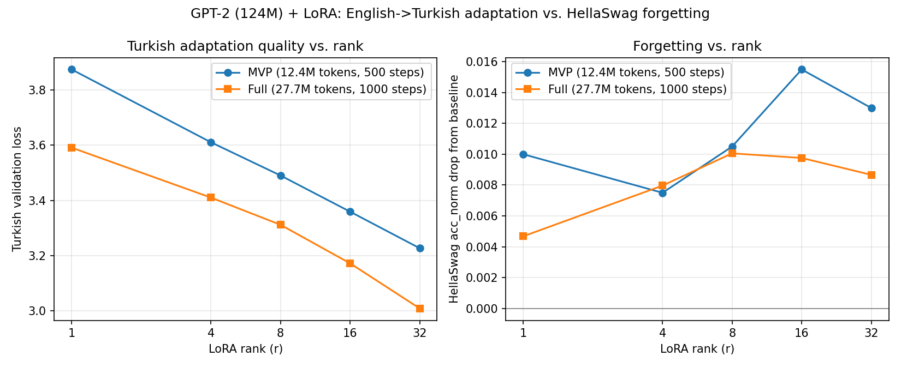

# Adapting an English-only GPT-2 to Turkish with LoRA: rank vs. quality vs. forgetting

**TL;DR:** LoRA-adapting the from-scratch GPT-2 (124M, OpenAI's original English-only pretrained weights) on Turkish Wikipedia text produces a clean, monotonic improvement in Turkish generation quality as LoRA rank increases, while the cost in retained English capability (measured via HellaSwag) stays small (≤1.6 accuracy points) and does *not* scale sharply with rank across a 32x range. Doubling the training data further improves Turkish quality at every rank without increasing forgetting.

This is a small, single-machine study (one RTX 4070 laptop GPU, no repeated seeds), not a paper. Treat the numbers as directional, not definitive. Every number below is machine-generated and reproducible with the commands in [Reproducing](#reproducing).

## Motivation

GPT-2's `tiktoken` BPE vocabulary was built almost entirely from English web text. Its byte-level fallback means it can *encode* any UTF-8 text, including Turkish, but it does so inefficiently: Turkish is agglutinative (heavy suffixing) and uses non-ASCII characters (ç, ğ, ı, ö, ş, ü) that the vocabulary wasn't optimized for. We measured this directly before running any training (`scripts/tokenizer_efficiency.py`, 200 documents per language):

| Language | Docs | Words | Tokens | Tokens/word | Bytes/token |
|---|---:|---:|---:|---:|---:|
| English (HellaSwag contexts) | 200 | 4,522 | 5,077 | 1.12 | 4.52 |
| Turkish (Wikipedia) | 200 | 347,204 | 1,303,931 | 3.76 | 2.24 |

**Turkish is 3.34x less token-efficient than English with this tokenizer.** Every Turkish word costs ~3.4x more of the model's fixed 1024-token context window than an English word would. This motivates the question: starting from a model with essentially no real Turkish exposure and a tokenizer that actively works against it, how much can a small, cheap LoRA adapter actually buy you, and at what cost to what the model already knows?

## Setup

- **Base model:** `GPT.from_pretrained("gpt2")`, the from-scratch 124M-parameter GPT-2 in this repo, itself verified to match Hugging Face's `GPT2LMHeadModel` logits within 1e-3 (see main [README](README.md)).
- **LoRA:** `src/lora.py`, targeting `c_attn`, `c_proj`, `c_fc` in every block. `alpha = 2r` held constant across the sweep so only rank (representational capacity) varies. Holding `alpha` fixed instead would confound rank with LoRA's effective update magnitude (`scaling = alpha / r`).
- **Data:** Turkish Wikipedia (`wikimedia/wikipedia`, config `20231101.tr`), streamed and tokenized with the existing `scripts/prepare_data.py` (no modifications needed, since it's dataset-agnostic).
- **Forgetting metric:** HellaSwag acc_norm (`src/hellaswag.py`), the same harness this repo already uses to reproduce GPT-2's published 29.5% acc_norm, run before and after each LoRA fine-tune.
- **Hardware:** single RTX 4070 Laptop GPU, 8GB VRAM. `batch_size=4, block_size=1024` throughout, with no OOM at any point in either sweep. This repo has no gradient checkpointing, so LoRA's memory savings here are in optimizer state only, not activations, which is why batch size had to stay conservative.

Two training runs were done, at two data scales:

| | Tokens | Steps | Effective passes over corpus |
|---|---:|---:|---:|
| MVP | 12.4M | 500 | ~1.3x |
| Full | 27.7M | 1000 | ~1.2x |

Rank swept at `r ∈ {1, 4, 8, 16, 32}` for both scales, `alpha = 2r`.

## Results



### Baseline (no LoRA)

| | HellaSwag acc_norm |
|---|---:|
| Full HellaSwag set (10,042 examples) | **0.2955** (matches this repo's existing reproduction of the paper's 29.5%) |

### Rank sweep: MVP (12.4M tokens, 500 steps, HellaSwag on a 2,000-example subset)

| r | alpha | Turkish val loss | HellaSwag acc_norm | Forgetting (Δ from baseline) |
|---:|---:|---:|---:|---:|
| 1 | 2 | 3.874 | 0.3265 | 0.0100 |
| 4 | 8 | 3.611 | 0.3290 | 0.0075 |
| 8 | 16 | 3.490 | 0.3260 | 0.0105 |
| 16 | 32 | 3.359 | 0.3210 | 0.0155 |
| 32 | 64 | 3.227 | 0.3235 | 0.0130 |

### Rank sweep: Full (27.7M tokens, 1000 steps, HellaSwag on the full 10,042-example set)

| r | alpha | Turkish val loss | HellaSwag acc_norm | Forgetting (Δ from baseline) |
|---:|---:|---:|---:|---:|
| 1 | 2 | 3.591 | 0.2908 | 0.0047 |
| 4 | 8 | 3.410 | 0.2875 | 0.0080 |
| 8 | 16 | 3.312 | 0.2854 | 0.0101 |
| 16 | 32 | 3.173 | 0.2857 | 0.0098 |
| 32 | 64 | 3.010 | 0.2868 | 0.0087 |

### Two findings

1. **Turkish adaptation quality improves monotonically with rank, at both data scales.** Validation loss on held-out Turkish text drops steadily from r=1 to r=32 (3.87→3.23 at the MVP scale, 3.59→3.01 at full scale). More capacity keeps helping across the whole swept range, with no sign of saturation yet even at r=32.
2. **Forgetting is small and does not scale sharply with rank.** Across a 32x increase in rank, HellaSwag acc_norm never drops by more than 1.55 points, and the trend is closer to flat/noisy than to a clean scaling curve. Going from 12.4M to 27.7M training tokens (recalibrated to keep the number of passes over the corpus roughly constant) improved Turkish quality further at *every* rank without increasing forgetting. If anything, forgetting is flat-to-lower at the larger data scale (most visibly at r=16: 0.0155 → 0.0098).

Caveat: this is one training run per (rank, scale) configuration, so there's no repeated-seed error bar and small differences between adjacent ranks (e.g. r=4 vs r=8 forgetting) shouldn't be over-interpreted. The larger, cross-scale pattern (rank helps quality, forgetting stays bounded, more data doesn't obviously hurt retention) is the part worth trusting.

## Qualitative examples

Same prompt, same sampling seed, base model vs. the best full-scale adapter (r=32, 27.7M tokens):

> **Prompt:** *"Bilim insanları yeni bir"* ("Scientists a new")
>
> **Baseline (no LoRA):** `Bilim insanları yeni birüşçağim hannıtıçanısıi\n\ndām ðe mensihanısıtı sertimêtı.\n\nsalığı, s` (drifts into non-Turkish, non-word noise almost immediately)
>
> **r=32 (full-scale LoRA):** `Bilim insanları yeni bir ülking oluplarına ilk insanlarına görülmek için de etkilerinin görülmektedir.` (broken grammar, but built almost entirely from real Turkish words and morphology: *ilk*, *insanlarına*, *etkilerinin*, *görülmektedir*)

> **Prompt:** *"Osmanlı İmparatorluğu döneminde"* ("During the Ottoman Empire period")
>
> **Baseline:** `Osmanlı İmparatorluğu döneminde fünşdınıs vezları difotur.\n\nÇar, Anıl Özmşi İmparatorluğu.` (largely invented tokens)
>
> **r=32:** `Osmanlı İmparatorluğu döneminde Konya (Lüküçü) sahnyanın yapılan kângardeşlerle birlikte bulunan ilginli bir albüm` (references a real place name, *Konya*, and strings together plausible Turkish phrases: *yapılan*, *birlikte bulunan*, *ilginli bir albüm*)

None of this is fluent. 500-1000 steps on a few tens of millions of tokens through a rank-limited adapter was never going to produce publication-quality Turkish. What's notable is the *direction* of the shift: the baseline model treats Turkish text as something to escape from (drifting toward English or pure noise), while the LoRA-adapted models increasingly commit to Turkish vocabulary and morphology as rank grows. Full generations for every prompt/rank/scale combination are in `results/turkish_lora_study_mvp.json` and `results/turkish_lora_study_full.json`.

## Limitations

- Single seed per configuration: no variance estimate.
- Tokenizer is unchanged (still gpt2 BPE); the 3.3x token inefficiency measured above is a ceiling on what LoRA alone can fix. A real Turkish deployment would want a Turkish-aware tokenizer and a Turkish-pretrained base, not an English GPT-2 patched with an adapter.
- HellaSwag is one proxy for "general capability retained"; it doesn't cover everything a full-fine-tune-vs-LoRA forgetting comparison would want to check.
- Only one Turkish data source (Wikipedia) was used; results may differ on more colloquial or noisier text (e.g. OSCAR/mC4 web crawl).

## Reproducing

```bash
# 1. Tokenizer efficiency measurement
python scripts/tokenizer_efficiency.py --n_docs 200 --output results/tokenizer_efficiency.json

# 2. Prepare Turkish data (either scale)
python scripts/prepare_data.py --dataset_name wikimedia/wikipedia --dataset_config 20231101.tr \
  --output_dir data/turkish_wiki_mvp --shard_size 200000 --max_docs 3000

# 3. Run the rank sweep
python scripts/turkish_lora_study.py \
  --pretrained gpt2 --data_dir data/turkish_wiki_mvp \
  --ranks 1,4,8,16,32 --alpha_ratio 2 \
  --batch_size 4 --block_size 1024 --total_batch_size 32768 \
  --max_steps 500 --warmup_steps 50 --max_lr 3e-4 --weight_decay 0.1 --seed 1337 \
  --hellaswag_data hellaswag/hellaswag_val.jsonl --hellaswag_limit 2000 --hellaswag_full_baseline \
  --results_path results/turkish_lora_study_mvp.json

# 4. Plot
python scripts/plot_turkish_lora_study.py
```

See `scripts/turkish_lora_study.py --help` for the full-scale run's arguments (larger `--max_docs`, recalibrated `--max_steps`).
